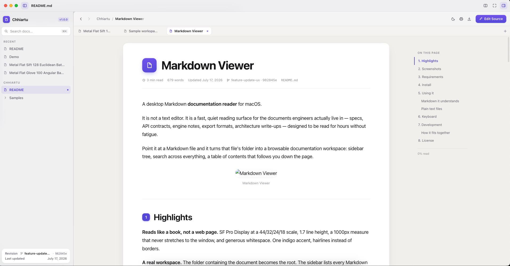
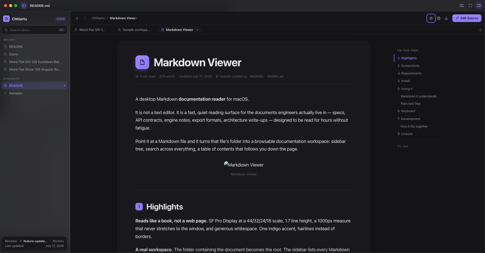
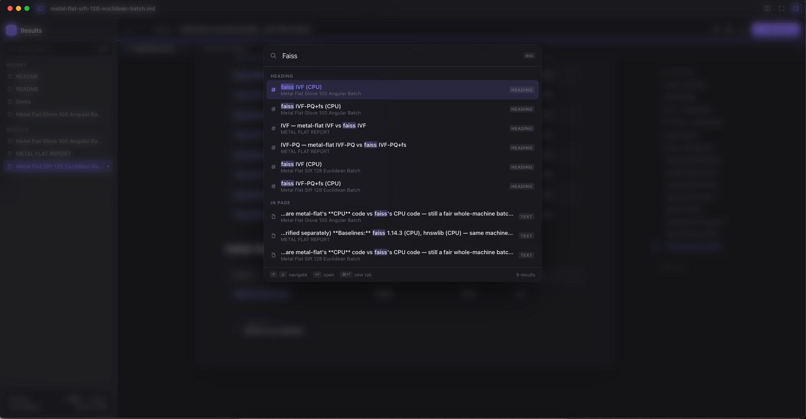
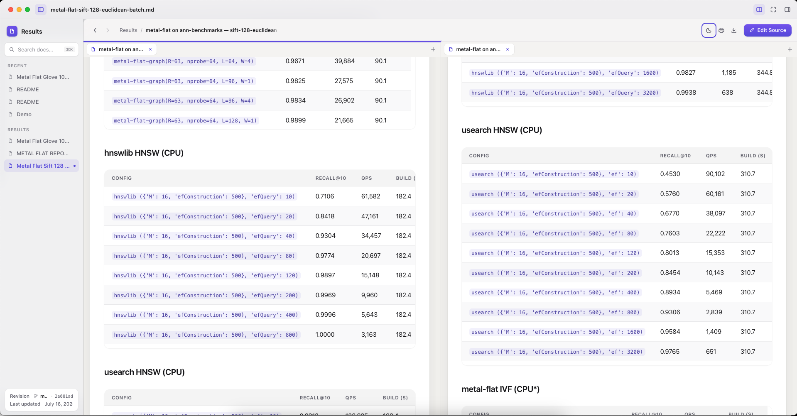

# Markdown Viewer

A desktop Markdown **documentation reader** for macOS.

It is not a text editor. It is a fast, quiet reading surface for the documents
engineers actually live in — specs, API contracts, engine notes, export formats,
architecture write-ups — designed to be read for hours without fatigue.

Point it at a Markdown file and it turns that file's folder into a browsable
documentation workspace: sidebar tree, search across everything, a table of
contents that follows you down the page.


---

## Highlights

**Reads like a book, not a web page.** SF Pro Display at a 44/32/24/18 scale,
1.7 line height, a 1000px measure that never stretches to the window, and
generous whitespace. One indigo accent, hairlines instead of borders.

**A real workspace.** The folder containing the document becomes the root. The
sidebar lists every Markdown file under it, with recents, breadcrumbs,
Previous/Next paging, and a status card showing the git branch and revision.

**Search that reaches everything.** `⌘K` opens a floating palette that searches
titles, headings, body text, and code across the whole workspace, with match
highlighting and previews.

**Tabs, pinning, and split view.** Tabs load lazily and survive a restart. A
pinned tab is a promise the document stays put — navigating from it opens a new
tab rather than replacing it. `⌘\` splits the window into two independent
readers.

**Documents look expensive.** Numbered section badges, tinted callouts, floating
code cards with a language badge and copy button, rounded tables with sticky
headers and resizable columns, click-to-zoom images, math, and Mermaid diagrams.

**Dark and light**, following the system or pinned to one.

---

## Screenshots

| | |
|---|---|
|  |  |
| Reading a document | The same document, dark |
|  |  |
| `⌘K` search palette | Split view |

---

## Requirements

- macOS on Apple Silicon (the build targets `arm64`, and uses native window
  vibrancy and `iconutil`)
- Node.js 18+ (developed on 23)

## Install

```bash
git clone git@github.com:Kakcalu13/chhiartu.git
cd chhiartu
npm install
```

Run it in development:

```bash
npm start
```

Build a real `.app`:

```bash
npm run dist
```

That writes `dist/mac-arm64/Markdown Viewer.app`. Drag it to `/Applications`.
The app is ad-hoc signed, not notarized — it is meant for your own machine.

Once installed it registers as a handler for `.md` and `.txt`, so **Open With**
and *Get Info → Always Open With* work as you'd expect.

---

## Using it

**Open a document** by dropping it on the window, `⌘O`, or double-clicking a
`.md` file in Finder. Its folder becomes the workspace.

**Open a folder** directly with `⇧⌘O`, or by clicking the project name at the
top of the sidebar.

**The sidebar tree lists Markdown only.** A source tree is full of `.txt` files
that aren't documentation, so they're kept out of the index — but they still
open fine.

### Markdown it understands

Everything in GitHub Flavored Markdown — tables, task lists, strikethrough,
footnotes — plus:

**Callouts.** GitHub alert syntax becomes a tinted card:

```markdown
> [!NOTE]
> Blue. Also: TIP and IMPORTANT (purple), SUCCESS (green),
> WARNING (orange), CAUTION / DANGER (red).
```

**Code blocks with a filename.** Either form works:

````markdown
```json:kawr_export.glb
{ "extras": { "version": 1 } }
```

```ts title="src/app.ts"
export const x = 1;
```
````

**Math**, typeset with KaTeX — inline `$E = mc^2$`, or display:

```markdown
$$
t(n) = 0.35 + \frac{1.05\,n}{1000}
$$
```

`\(…\)` and `\[…\]` work too. Ordinary prose is left alone: `$5 and $10` stays
money, and `$PATH` in a code block stays a shell variable.

**Mermaid diagrams** from ```` ```mermaid ```` fences, with zoom controls.

**Frontmatter.** A `status:` or `author:` key surfaces in the document header
and the sidebar's status card:

```markdown
---
title: Export Contract
status: Draft
author: Platform Team
---
```

### Plain text files

`.txt` opens too — nicer than the system default. How it renders is decided per
file:

- **Prose** (`notes.txt`) renders as Markdown, with real typography.
- **Layout-dependent** (`CMakeLists.txt`, an indented outline) renders verbatim
  in monospace, keeping every line break.

The distinction is whether the file's literal layout carries meaning. Markdown
treats a single newline as a soft wrap, so reflowing a `CMakeLists.txt` would
smear it into a paragraph — those files bypass the parser entirely.

---

## Keyboard

| | |
|---|---|
| `⌘K` | Search all documents |
| `⇧⌘K` | Quick outline of this document |
| `⌘O` / `⇧⌘O` | Open file / folder |
| `⌘T` / `⌘W` | New tab / close tab |
| `⇧⌘P` | Pin tab (or double-click it) |
| `⌃Tab` / `⌃⇧Tab` | Next / previous tab |
| `⌘\` | Split view |
| `⌘1` / `⌘2` | Focus left / right pane |
| `⌘[` / `⌘]` | Back / forward |
| `⌘↑` / `⌘↓` | Previous / next document |
| `⌥⌘S` / `⌥⌘T` | Toggle sidebar / table of contents |
| `⇧⌘F` | Focus mode |
| `⇧⌘L` | Toggle theme |
| `⌘E` | Edit source |
| `⌘P` / `⇧⌘E` | Print / export PDF |
| `space` / `⇧space` | Page down / up |
| `j` / `k` | Scroll down / up |
| `g` / `G` | Top / bottom |

---

## Development

```bash
npm test      # headless render tests — no GUI needed
npm run vendor # refresh vendor/ from node_modules
npm run icon   # rebuild build/icon.icns from assets/icon-source.png
```

### How it fits together

| Path | Role |
|---|---|
| `main.js` | Electron main: window, vibrancy, menus, IPC |
| `preload.js` | The bridge — exposes a small, explicit API to the renderer |
| `lib/markdown.js` | Markdown → HTML: callouts, code cards, math, `.txt` detection |
| `lib/workspace.js` | Folder scan, git revision, file stats |
| `renderer/` | The reading UI — shell, design system, panes |
| `scripts/` | Vendoring, icon generation, tests |
| `test/fixtures/` | A small workspace the tests render and scan |

It is worth knowing:

**`lib/` is shared with the tests.** `npm test` imports the same pipeline the
app runs, so what the tests assert is what ships.

---

## License

MIT
