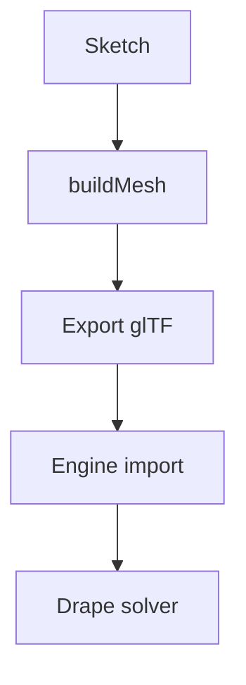

# Kawr → Duhthusam export contract

> [!NOTE]
> What `kawr_export.glb` must contain for duhthusam's garment-import pipeline.
> That doc owns the engine side — this file is the exporter's checklist.
> Current exporter status is noted per item.

## Panels

- One glTF mesh (+ node) per panel, indexed `TRIANGLES`, as today.
- Attributes per vertex: `POSITION` (have), `NORMAL` (missing), `TEXCOORD_0` (missing).
  - Normals: front cap +Y, back cap −Y in sketch space (opposed = garment outside once
    worn). The engine's inflate-paint pushes along these — garbage normals means garbage
    resize behavior.
  - UVs: planar per panel — normalize sketch-plane (x, z) over the panel's bounding box.
    Trivial for the lattice.
- **Deterministic vertex order**: same sketch → same vertex ids on every export.
  A reordered export silently scrambles the user's authoring.

## Density

- Export-time knob for `Shape::buildMesh(divisions)` — target **1.5–3k** verts per panel.
  The current default emits ~10.6k/panel.
- Print per-panel vert/tri counts at export so the number is seen, not discovered in
  the engine's profiler.

> [!WARNING]
> A 20k-node shirt costs ≈ 22 ms/frame. The solver runs at $t = 0.35 + 1.05n/1000$ ms.

Solver cost against node count $n$, with per-panel density $d$ and panel count $p$:

$$
t(n) = 0.35 + \frac{1.05\,n}{1000}
\quad\text{where}\quad
n = \sum_{i=1}^{p} d_i
$$

A budget of 16 ms/frame therefore caps the garment at $n \approx 14{,}900$ nodes.

## Seams — metadata, not welded geometry

Panels must start **apart** in the engine (sewing constraints pull them together during
the drape), so sewn edges may **not** be merged or welded at export. Instead, emit glTF
`extras` on the scene:

```json:kawr_export.glb
{
  "extras": {
    "kawr": {
      "version": 1,
      "seams": [
        { "a": { "panel": 0, "edge": 12 }, "b": { "panel": 1, "edge": 3 } }
      ]
    }
  }
}
```

### Reading the seam table

| Field     | Type     | Required | Notes                                  |
| --------- | -------- | -------- | -------------------------------------- |
| `version` | `int`    | yes      | Bump on any breaking change.           |
| `seams`   | `array`  | yes      | May be empty for a single-panel piece. |
| `a`, `b`  | `object` | yes      | Panel index + edge index, 0-based.     |
| `slack`   | `float`  | no       | Defaults to `0.0`.                     |

> [!TIP]
> Validate with `kawr verify --contract` before handing the file off.

## Materials (PBR)

- [x] Base color factor
- [x] Metallic / roughness factors
- [ ] Normal texture
- [ ] Occlusion texture

```ts
export interface PanelMaterial {
  baseColorFactor: [number, number, number, number];
  metallicFactor: number;
  roughnessFactor: number;
}

export function defaultMaterial(): PanelMaterial {
  return { baseColorFactor: [1, 1, 1, 1], metallicFactor: 0, roughnessFactor: 0.8 };
}
```

## Extras (scene)

The pipeline is a straight line — no branches, no retries:



Further reading: [the glTF 2.0 spec](https://registry.khronos.org/glTF/) and the
[engine notes](./guides/getting-started.md).

> A quoted aside keeps its own voice — used for commentary, not for warnings.

## Status

| Item      | State         |
| --------- | ------------- |
| Panels    | Done          |
| Density   | In progress   |
| Seams     | Blocked       |

Python reference implementation:

```python
def normalize_uv(points, bbox):
    """Planar UV projection over the panel's bounding box."""
    (min_x, min_z), (max_x, max_z) = bbox
    w, h = max_x - min_x, max_z - min_z
    return [((x - min_x) / w, (z - min_z) / h) for x, _, z in points]
```
