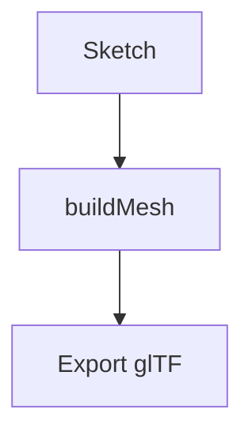

# Export contract

> [!NOTE]
> What `kawr_export.glb` must contain for the garment-import pipeline.
> Current exporter status is noted per item.

## Panels

- One glTF mesh (+ node) per panel, indexed `TRIANGLES`, as today.
- Attributes per vertex: `POSITION` (have), `NORMAL` (missing).
  - Normals: front cap +Y, back cap −Y in sketch space. The engine's
    inflate-paint pushes along these, so garbage normals mean garbage
    resize behavior.
  - UVs: planar per panel, normalized over the panel's bounding box.
- **Deterministic vertex order**: the same sketch must produce the same
  vertex ids on every export, or a reordered export silently scrambles
  the painted vertex groups the engine stores by id.

## Density

Export-time knob for `Shape::buildMesh(divisions)`, targeting 1.5–3k verts
per panel. Solver cost against node count is $t = 0.35 + 1.05n/1000$ ms:

$$
t(n) = 0.35 + \frac{1.05\,n}{1000}
\quad\text{where}\quad
n = \sum_{i=1}^{p} d_i
$$

A 16 ms frame budget therefore caps the garment at $n \approx 14{,}900$ nodes.

> [!WARNING]
> The current default emits ~10.6k verts per panel, which recreates the
> exact perf ceiling the engine just escaped.

## Seams

Panels must start apart, so sewn edges may ~~not~~ be merged at export.
Emit glTF `extras` on the scene instead:

```json:kawr_export.glb
{
  "extras": {
    "kawr": {
      "version": 1,
      "seams": [{ "a": { "panel": 0, "edge": 12 } }]
    }
  }
}
```

| Field     | Type     | Required | Notes                        |
| --------- | -------- | -------- | ---------------------------- |
| `version` | `int`    | yes      | Bump on any breaking change. |
| `seams`   | `array`  | yes      | May be empty.                |

> [!TIP]
> Validate with `kawr verify --contract` before handing the file off.

## Materials

- [x] Base color factor
- [x] Metallic / roughness factors
- [ ] Normal texture

```ts
export interface PanelMaterial {
  baseColorFactor: [number, number, number, number];
  metallicFactor: number;
}
```

```python
def normalize_uv(points, bbox):
    """Planar UV projection over the panel's bounding box."""
    (min_x, min_z), (max_x, max_z) = bbox
    return [((x - min_x), (z - min_z)) for x, _, z in points]
```

## Pipeline



Further reading: [the glTF 2.0 spec](https://registry.khronos.org/glTF/) and
the [engine notes](./guides/getting-started.md).

> A quoted aside keeps its own voice — commentary, not a warning.
